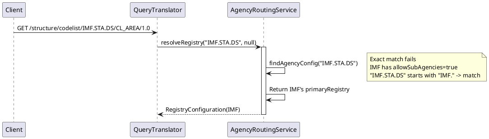
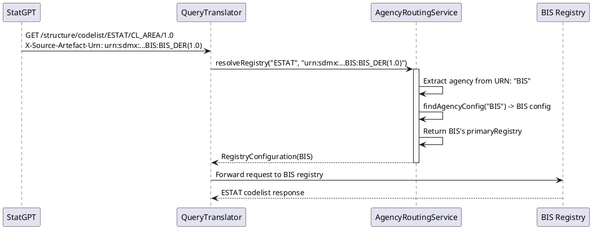
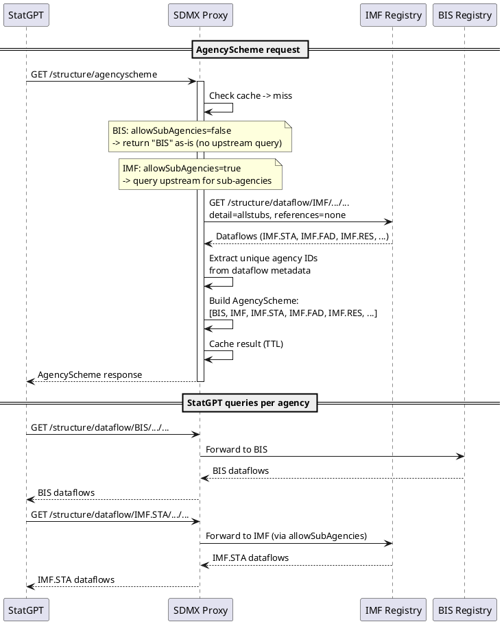

# Agency Routing

## Problem

The current agency routing system (`AgencyRoutingServiceImpl`) is fully static. All agency-to-registry mappings are
hardcoded in `sdmx_registries_config.json`. This creates several problems:

1. **Config bloat.** Every IMF sub-agency (IMF.STA, IMF.FAD, IMF.RES, IMF.STA.DS, IMF.MCM) needs its own entry, all
   pointing to the same primary registry. The agencies array has 14 entries; 5 are sub-agencies that exist only because
   the current lookup is exact-match.

2. **No wildcard matching.** If a registry serves all sub-agencies under a parent (e.g., IMF serves IMF.STA, IMF.FAD,
   IMF.RES, etc.), there is no way to express this as a single config entry. Each sub-agency must be listed explicitly.

3. **No standard way for clients to discover available agencies.** Clients (StatGPT) currently use `agency=*` fan-out
   to query all registries, which is expensive and couples the client to the proxy's internal registry list.

## Design Overview

The new routing model is simple:

- **Every configured agency has exactly one primary registry** (`primaryRegistry` is mandatory).
- **Only agencies with their own registry are configured.** Agencies served by another registry as a secondary
  (ESTAT, ISO, SDMX, LBS, CBS, MEDIT, MDD -- all served by BIS) are NOT in the config. They are only accessible via
  the `X-Source-Artefact-Urn` header (see "Routing Algorithm" section).
- **Wildcard matching via `allowSubAgencies`** eliminates sub-agency config entries. When `IMF` has
  `allowSubAgencies=true`, requests for `IMF.STA`, `IMF.STA.DS`, etc. all route to IMF's primary registry.
- **Synthetic AgencyScheme endpoint** replaces `agency=*` fan-out. The proxy builds an SDMX AgencyScheme response from
  its configured agencies. StatGPT queries this endpoint to discover available agencies, then queries each individually.

### What was removed and why

| Removed                                             | Reason                                                                            |
|-----------------------------------------------------|-----------------------------------------------------------------------------------|
| `secondaryRegistries` on `AgencyConfiguration`      | No fallback chain. Each agency routes to exactly one registry.                    |
| Fan-out (`agency=*`)                                | Replaced by synthetic AgencyScheme endpoint. Clients query agencies individually. |
| Comma-separated agencies (`agency=BIS,IMF`)         | Same as fan-out. Not supported.                                                   |
| Agency discovery (AgencyScheme / ENUMERATION)       | Agencies are configured manually. No automated discovery needed.                  |
| Artefact-type filtering (`artefactTypesByRegistry`) | No secondary registries to filter between. One registry per agency.               |
| Fallback loop / routing cache                       | No secondaries to fall back to. No runtime trial-and-error.                       |

## Config Model Changes

### AgencyConfiguration

Current (`sdmx-proxy-config/.../data/AgencyConfiguration.java`):

```java
@Data
public class AgencyConfiguration {
    private String name;
    private String primaryRegistry;
    private List<String> secondaryRegistries;
}
```

New:

```java
@Data
public class AgencyConfiguration {
    private String name;
    private String primaryRegistry;          // MANDATORY
    private boolean allowSubAgencies;        // default false
}
```

Changes:

- `primaryRegistry` is now mandatory. Every configured agency must have one.
- `secondaryRegistries` is removed. No fallback chain.
- `allowSubAgencies` (new) -- when `true`, all requests for `{name}.*` sub-agencies route to this agency's config.

### Config before/after

Before (14 entries):

```json
"agencies": [
{"name": "BIS", "primaryRegistry": "BIS"},
{"name": "IMF", "primaryRegistry": "IMF", "secondaryRegistries": ["BIS"] },
{"name": "IMF.STA", "primaryRegistry": "IMF" },
{"name": "IMF.FAD", "primaryRegistry": "IMF" },
{"name": "IMF.RES", "primaryRegistry": "IMF" },
{"name": "IMF.STA.DS", "primaryRegistry": "IMF" },
{"name": "IMF.MCM", "primaryRegistry": "IMF" },
{"name": "ESTAT", "secondaryRegistries": ["BIS"] },
{"name": "ISO", "secondaryRegistries": ["BIS", "IMF"] },
{"name": "SDMX", "secondaryRegistries": ["BIS", "IMF"] },
{"name": "LBS", "secondaryRegistries": ["BIS"] },
{"name": "CBS", "secondaryRegistries": ["BIS"] },
{"name": "MEDIT", "secondaryRegistries": ["BIS"] },
{"name": "MDD", "secondaryRegistries": ["BIS"] }
]
```

After (2 entries -- sub-agencies eliminated via `allowSubAgencies`, secondary-only agencies removed):

```json
"agencies": [
{"name": "BIS", "primaryRegistry": "BIS"},
{"name": "IMF", "primaryRegistry": "IMF", "allowSubAgencies": true}
]
```

Only BIS and IMF remain because they are the only agencies with their own registries. Agencies previously configured
as secondary-only (ESTAT, ISO, SDMX, LBS, CBS, MEDIT, MDD) are removed from the config entirely. They are served by
BIS but can only be accessed when the client provides an `X-Source-Artefact-Urn` header indicating the source registry
(see "Routing Algorithm" below).

IMF sub-agencies (IMF.STA, IMF.FAD, IMF.RES, IMF.STA.DS, IMF.MCM) are eliminated because `allowSubAgencies=true` on
IMF catches all `IMF.*` requests.

## Routing Algorithm

### findAgencyConfig

Replace the exact-match lookup with a two-step algorithm using `allowSubAgencies`:

```
findAgencyConfig("IMF.STA.DS", agencies):
  1. Try exact match: "IMF.STA.DS" -> not found
  2. Iterate agencies with allowSubAgencies=true:
     - IMF has allowSubAgencies=true
     - "IMF.STA.DS".startsWith("IMF.") -> true -> FOUND -> return IMF config
```

Priority order:

1. **Exact match** (highest priority)
2. **Sub-agency match** -- iterate agencies where `allowSubAgencies=true` and check if the requested agency ID starts
   with `{name}.`. If multiple agencies match, the longest prefix wins (most specific match).

```java
private AgencyConfiguration findAgencyConfig(String agencyId, List<AgencyConfiguration> agencies) {
    // 1. Exact match (highest priority)
    for (AgencyConfiguration agency : agencies) {
        if (agencyId.equals(agency.getName())) {
            return agency;
        }
    }

    // 2. Sub-agency match: longest prefix wins
    AgencyConfiguration bestMatch = null;
    for (AgencyConfiguration agency : agencies) {
        if (agency.isAllowSubAgencies() && agencyId.startsWith(agency.getName() + ".")) {
            if (bestMatch == null || agency.getName().length() > bestMatch.getName().length()) {
                bestMatch = agency;
            }
        }
    }

    return bestMatch;
}
```

Config validation should reject malformed agency names (leading/trailing dots, empty strings).

### resolveRegistry

The routing algorithm has two paths:

**Path 1: X-Source-Artefact-Urn header present (cross-reference routing)**

When a client follows a cross-reference (e.g., a BIS dataflow references an ESTAT codelist), it sets the
`X-Source-Artefact-Urn` header to the source artefact's URN. The proxy extracts the agency from the header URN and
routes to that agency's primary registry.

```
Request: GET /structure/codelist/ESTAT/CL_AREA/1.0
Header:  X-Source-Artefact-Urn: urn:sdmx:org.sdmx.infomodel.datastructure.DataStructure=BIS:BIS_DER(1.0)

1. Extract agency from header URN: "BIS"
2. findAgencyConfig("BIS") -> BIS config
3. Route to BIS's primaryRegistry -> BIS registry
```

The header agency is the primary routing signal. The path agency (ESTAT) may differ from the header agency -- this is
expected in cross-reference scenarios. The header tells the proxy which registry has the artefact.

In the current codebase, Path 1 has a cross-check that verifies the candidate registry is in the requested agency's
registry set. In the new design, this cross-check is removed because there are no secondary registries to check
against. The header agency simply determines the registry. This is safe because the header is set by the client
(StatGPT) which knows the source context.

**Path 2: No header (standard routing)**

```
Request: GET /structure/codelist/IMF.STA.DS/CL_AREA/1.0

1. Extract agency from path: "IMF.STA.DS"
2. findAgencyConfig("IMF.STA.DS") -> IMF config (via allowSubAgencies)
3. Route to IMF's primaryRegistry -> IMF registry
```

If the agency is not found in the config (no exact match and no `allowSubAgencies` match), the request fails with
`AgencyRoutingException`.

### Unsupported: agency=* and comma-separated agencies

Requests with `agency=*` (wildcard) or comma-separated agencies (e.g., `agency=BIS,IMF`) return
**501 Not Implemented**. The 501 response uses the proxy's standard SDMX error message format (same as other error
responses from `GlobalExceptionHandler`).

Clients should use the synthetic AgencyScheme endpoint to discover available agencies and query them individually.

## Synthetic AgencyScheme Endpoint

### Purpose

Replaces `agency=*` fan-out for StatGPT. Instead of querying all registries in parallel, StatGPT:

1. Calls the proxy's AgencyScheme endpoint to discover available agencies (including sub-agencies)
2. Queries each agency individually for dataflows and structures

### Endpoint

```
GET /structure/agencyscheme
```

The proxy builds an SDMX AgencyScheme response that combines:

1. **All configured agencies** from the `agencies[]` array (BIS, IMF).
2. **Discovered sub-agencies** for agencies with `allowSubAgencies=true`. For these agencies, the proxy queries
   the upstream registry's dataflows and extracts the unique agency IDs from the results.

Agencies without `allowSubAgencies` (e.g., BIS) are returned as-is -- no upstream query.

### How sub-agency discovery works

For each agency with `allowSubAgencies=true` (e.g., IMF):

1. The proxy queries the upstream registry for all dataflows:
   `GET /structure/dataflow/{agencyId}/.../...` with `detail=allstubs` and `references=none` (minimal payload)
2. Extracts unique agency IDs from the returned dataflow metadata (e.g., IMF.STA, IMF.FAD, IMF.RES, IMF.STA.DS,
   IMF.MCM)
3. Includes these sub-agencies in the AgencyScheme response alongside the parent agency

This is a runtime query, not config-time discovery. The result is **cached with a TTL** (configurable, default TBD)
to avoid hitting upstream registries on every AgencyScheme request. The cache is invalidated when the proxy config
changes (detected by the config server poller).

### Response format

Standard SDMX 3.0 structure message with an AgencyScheme, built using sdmx-core's mutable bean API
(`AgencySchemeMutableBeanImpl`, `AgencyMutableBeanImpl`) and serialized through the existing
`StreamingStructureConversionService.convert(SdmxBeans, OutputStream, MediaType)` pipeline.

Example response:

```json
{
  "data": {
    "agencySchemes": [
      {
        "id": "AGENCIES",
        "agencyID": "SDMX_PROXY",
        "name": "SDMX Proxy Configured Agencies",
        "version": "1.0",
        "agencies": [
          { "id": "BIS", "name": "Bank for International Settlements" },
          { "id": "IMF", "name": "International Monetary Fund" },
          {
            "id": "IMF.STA",
            "name": "IMF.STA"
          },
          {
            "id": "IMF.FAD",
            "name": "IMF.FAD"
          },
          {
            "id": "IMF.RES",
            "name": "IMF.RES"
          },
          {
            "id": "IMF.STA.DS",
            "name": "IMF.STA.DS"
          },
          {
            "id": "IMF.MCM",
            "name": "IMF.MCM"
          }
        ]
      }
    ]
  }
}
```

Agency names for configured agencies can be derived from `RegistryConfiguration.description`. Sub-agency names default
to the agency ID (upstream dataflows may not carry agency descriptions).

### How StatGPT uses it

Current flow (being replaced):
```
StatGPT -> GET /structure/dataflow/*/... (agency=*) -> fan-out to ALL registries -> merged response
```

New flow:
```
StatGPT -> GET /structure/agencyscheme -> [BIS, IMF, IMF.STA, IMF.FAD, ...]
StatGPT -> GET /structure/dataflow/BIS/... -> BIS registry
StatGPT -> GET /structure/dataflow/IMF/... -> IMF registry
StatGPT -> GET /structure/dataflow/IMF.STA/... -> IMF registry (via allowSubAgencies)
...
```

This is more explicit, avoids the fan-out complexity, and gives StatGPT control over which agencies to query.

## Sequence Diagrams

### Standard routing with allowSubAgencies



### Path 1: Cross-reference routing via header



### StatGPT agency discovery flow



## Implementation Plan

### Phase 1: Simplify routing + allowSubAgencies

**Scope:** Remove secondary registries, add `allowSubAgencies`, simplify Path 1, reject `agency=*` and
comma-separated.

**Files:**

| File                                | Change                                                                                                                         |
|-------------------------------------|--------------------------------------------------------------------------------------------------------------------------------|
| `AgencyConfiguration.java`          | Remove `secondaryRegistries`, add `allowSubAgencies`, make `primaryRegistry` mandatory                                         |
| `AgencyRoutingService.java`         | Simplify `resolveRegistry()` (may remove or simplify `sourceArtefactUrn` handling)                                             |
| `AgencyRoutingServiceImpl.java`     | Replace `findAgencyConfig()` with `allowSubAgencies` algorithm; remove secondary walking; simplify Path 1 (no cross-check)     |
| `QueryTranslatorImpl.java`          | Remove `requiresFanOut()`, `translateToFanOutStructures()`, all fan-out helpers. Return 501 for `agency=*` and comma-separated |
| `SdmxStructure30Controller.java`    | Remove fan-out code path                                                                                                       |
| `AdapterRouterImpl.java`            | Remove `getStructuresWithFanOut()` and related parallel execution code                                                         |
| `sdmx_registries_config.json`       | Reduce to 2 agencies (BIS, IMF), add `allowSubAgencies` on IMF, remove all `secondaryRegistries`                               |
| `StructureFanOutException.java`     | Remove (no longer needed)                                                                                                      |
| `AgencyRoutingServiceImplTest.java` | Rewrite tests for new routing model                                                                                            |
| `QueryTranslatorImplTest.java`      | Update tests (remove fan-out, update mocks)                                                                                    |
| E2E registry configs                | Update agencies in test configs                                                                                                |

### Phase 2: Synthetic AgencyScheme endpoint

**Scope:** New endpoint that builds an AgencyScheme from config + upstream dataflow queries for `allowSubAgencies`
registries. Cached with TTL.

**Files:**

| File                                                          | Change                                                                                                                                                   |
|---------------------------------------------------------------|----------------------------------------------------------------------------------------------------------------------------------------------------------|
| New controller (or addition to existing structure controller) | `GET /structure/agencyscheme` endpoint                                                                                                                   |
| New service (e.g., `AgencySchemeService.java`)                | Builds AgencyScheme: reads config agencies, queries upstream dataflows for `allowSubAgencies` registries, extracts sub-agency IDs, assembles `SdmxBeans` |
| `CacheService` or dedicated cache                             | Cache the assembled AgencyScheme response with TTL, invalidate on config change                                                                          |
| Unit tests                                                    | Test AgencyScheme assembly logic, caching, sub-agency extraction                                                                                         |

**Implementation approach:** Build `SdmxBeans` programmatically using sdmx-core's mutable bean API:

1. Create `AgencySchemeMutableBeanImpl` (id=`"AGENCIES"`, agencyId=`"SDMX_PROXY"`)
2. For each configured agency: add `AgencyMutableBeanImpl` with id and name
3. For each agency with `allowSubAgencies=true`: query upstream dataflows via the proxy's existing SDMX client
   infrastructure (`GenericRegistryAdapter`), extract unique agency IDs from the response, add each as an
   `AgencyMutableBeanImpl`
4. Convert to immutable: `scheme.getImmutableInstance()`
5. Wrap in `SdmxBeansImpl` container
6. Serialize through `StreamingStructureConversionService.convert(SdmxBeans, OutputStream, MediaType)`

**Note:** `StructureMapperImpl` currently has no AgencyScheme mapper (only handles codelists, concept schemes, DSDs,
dataflows, category schemes, content constraints). An `AgencySchemeMapper` needs to be added following the same pattern
as the existing mappers, or the serialization must bypass the mapper and use sdmx-core's writer engines directly.

## Test Plan

### Phase 1: Routing

- `findAgencyConfig("IMF")` -> returns IMF config (exact match)
- `findAgencyConfig("BIS")` -> returns BIS config (exact match)
- `findAgencyConfig("IMF.STA.DS")` -> returns IMF config (`allowSubAgencies=true`, starts with `"IMF."`)
- `findAgencyConfig("IMF.STA")` -> returns IMF config (via `allowSubAgencies`)
- `findAgencyConfig("UNKNOWN.AGENCY")` -> returns null (no match)
- `findAgencyConfig("ESTAT")` -> returns null (not in config, no `allowSubAgencies` match)
- `findAgencyConfig("IMFSTA")` -> does NOT match IMF (no dot separator -- `startsWith("IMF.")` fails)
- `allowSubAgencies=false` (default) does NOT match sub-agencies
- Multiple `allowSubAgencies` matches: longest prefix wins (e.g., both `IMF` and `IMF.STA` configured with
  `allowSubAgencies=true`, request for `IMF.STA.DS` -> matches `IMF.STA`)
- Config validation rejects agency names with leading/trailing dots
- Path 1: header `X-Source-Artefact-Urn` with BIS URN -> routes to BIS regardless of path agency
- Path 1: header with unknown agency URN -> `AgencyRoutingException`
- Path 2: agency in config -> routes to primaryRegistry
- Path 2: agency not in config -> `AgencyRoutingException`
- `agency=*` -> 501 Not Implemented
- `agency=BIS,IMF` -> 501 Not Implemented
- Existing E2E tests pass with reduced config

### Phase 2: Synthetic AgencyScheme

- `GET /structure/agencyscheme` returns valid SDMX 3.0 structure message
- Response contains configured agencies (BIS, IMF)
- Response contains sub-agencies discovered from upstream for `allowSubAgencies` registries (IMF.STA, IMF.FAD, etc.)
- Agencies without `allowSubAgencies` (BIS) do NOT trigger upstream queries
- Response is cached; subsequent requests return cached result
- Cache is invalidated on config change
- Upstream dataflow query failure for one registry -> log warning, return configured agencies without sub-agencies
  for that registry
- Content-type negotiation (SDMX JSON, SDMX ML if supported)

## Risks and Mitigations

| Risk                                                                                | Mitigation                                                                                                                                                  |
|-------------------------------------------------------------------------------------|-------------------------------------------------------------------------------------------------------------------------------------------------------------|
| Agencies without own registry (ESTAT, ISO, etc.) become inaccessible without header | Expected behavior. StatGPT provides `X-Source-Artefact-Urn` when following cross-references. Direct access was never needed by StatGPT for these agencies.  |
| `allowSubAgencies` ambiguity with multiple matches                                  | Longest prefix wins algorithm (deterministic). Document that more specific config entries take priority.                                                    |
| Removing fan-out breaks existing `agency=*` clients                                 | StatGPT is the primary client and will be updated to use AgencyScheme endpoint. 501 response clearly signals the change.                                    |
| Upstream dataflow query for sub-agency discovery fails or is slow                   | Cache with TTL reduces frequency. On failure, return configured agencies without sub-agencies for that registry. Log warning.                               |
| BIS serves agencies (ESTAT, ISO) that are not in the proxy config                   | These agencies are accessible via `X-Source-Artefact-Urn`. If direct access is needed later, they can be added to the config with `primaryRegistry: "BIS"`. |
